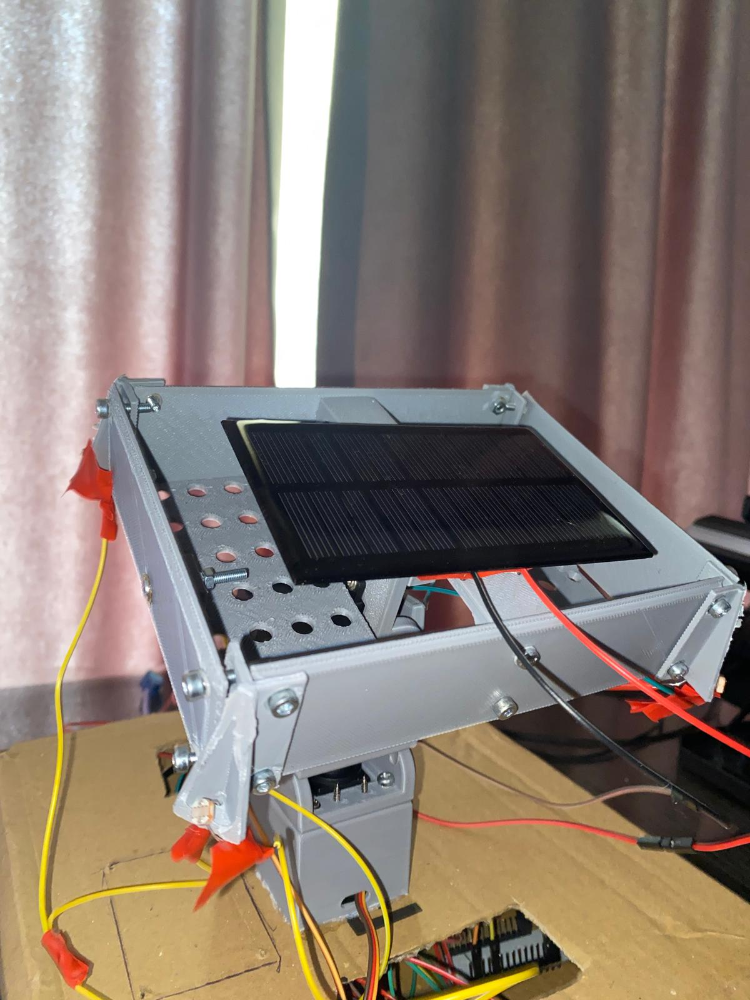
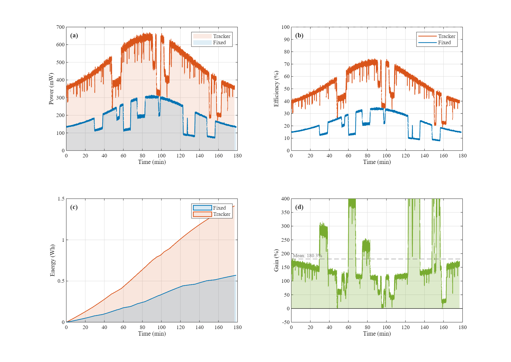

# ☀️ SolarDuel

### *A dual-axis solar tracker built as a controlled experiment, not a demo.*

<p align="center">
  
  
  
  
  
  
  
</p>

> SolarDuel runs a **motor-driven tracker** and a **fixed reference panel** side-by-side under identical irradiance, then quantifies the energy difference with a calibrated INA226 power monitor. The goal isn't just to track the sun — it's to **prove the gain**, with numbers.

---

## 📋 Table of Contents

- [What Makes This Different](#-what-makes-this-different)
- [System Architecture](#-system-architecture)
- [Bill of Materials](#-bill-of-materials)
- [Hardware Schematic](#-hardware-schematic)
- [System Photo](#-system-photo)
- [Control Pipeline — The Engineering Core](#️-control-pipeline--the-engineering-core)
- [Signal Flow Diagram](#-signal-flow-diagram)
- [Logger & Dashboard](#-logger--dashboard)
- [Efficiency Analysis Results](#-efficiency-analysis-results)
- [Repository Structure](#-repository-structure)
- [How to Run](#-how-to-run)
- [3D Print Settings](#️-3d-print-settings)
- [License](#-license)

---

## 🎯 What Makes This Different

Most LDR trackers on the internet are a four-resistor bridge wired into an `analogWrite()` loop. SolarDuel treats the same problem as a **real control engineering exercise**:

| Concern | Naïve tracker | SolarDuel |
|---|---|---|
| Sensor noise | Raw `analogRead()` | Per-channel **Kalman filter** + ADC oversampling |
| Hunting at boundary | Single threshold → chatter | **Adaptive deadband** with **2.5× hysteresis exit** |
| Twitching on light flicker | Acts on every blip | **Debounced activation** (confirmation counter) |
| Derivative kick on setpoint | None / unfiltered | **Derivative-on-measurement** with bilinear LPF |
| Integrator runaway at servo limit | Windup → overshoot | **Trapezoidal integration** + **conditional anti-windup** |
| Mechanical snap | Step PWM commands | **Slew-rate limiter** (15 μs / loop) |
| Boot-time shock | Servo snaps to home | **1-second soft-start ramp** |
| Loop timing jitter | `delay()` in `loop()` | **Fixed 200 Hz scheduler**, tick-overflow safe |
| Data acquisition vs. control | Same MCU → coupling | **Two isolated MCUs** — STM32 controls, ESP32 observes |

The result is a servo that moves like it has inertia — smoothly, decisively, and without the cricket-leg twitching that plagues hobby trackers.

---

## 🏗️ System Architecture

SolarDuel is deliberately split into two electrically and logically isolated units. The tracker never knows it's being measured; the logger never affects motor timing.

```
┌──────────────────────────────────────────────────────────┐
│                    TRACKER UNIT  (STM32)                 │
│                                                          │
│   4× LDR ──ADC──► STM32-G031K8 ──PWM──► 2× Servo (Pan/Tilt)
│                       │                                  │
│                       └─ Kalman → PID → Slew → Soft-LPF  │
└──────────────────────────────────────────────────────────┘

┌──────────────────────────────────────────────────────────┐
│                    LOGGER UNIT  (ESP32)                  │
│                                                          │
│   Panel ──► 47 Ω load ──► INA226 ──I²C──► ESP-WROOM-32   │
│                                              │           │
│                                              ├─► WiFi → Browser dashboard
│                                              └─► /csv  → Timestamped CSV
└──────────────────────────────────────────────────────────┘
```

---

## 🧰 Bill of Materials

| Component | Role / Specification | Qty |
|---|---|---:|
| **STM32-NUCLEO-G031K8** | Tracker MCU — LDR sampling, control loop, PWM | 1 |
| **ESP-WROOM-32** | Logger MCU — INA226 readout, web server, CSV export | 1 |
| **LDR (GL5528 class)** | Cross-placed light sensors, 3.3 V dividers | 4 |
| **INA226** | 16-bit I²C power monitor, 0.1 Ω shunt | 1 |
| **Servo (MG996R / SG90)** | Pan + tilt actuators | 2 |
| **Solar panel** | 6 V / 150 mA monocrystalline | 2 |
| **Dummy load** | 47 Ω 5 W ceramic resistor (MPP-adjacent operating point) | 1 |
| **Resistors** | 10 kΩ LDR voltage dividers | 4 |
| **Power supply** | 5 V / 3 A external adapter (servos) | 1 |
| **Mechanical** | Custom 3D-printed pan-tilt frame, PLA | — |

---

## 🔌 Hardware Schematic

Full wiring for both units — tracker (STM32 + LDRs + servos) and logger (ESP32 + INA226 + dummy load):

📄 **[Hardware Schematic (PDF)](Hardware/hardware_schematic.pdf)**

**Wiring highlights:**
- INA226: `SDA → GPIO21`, `SCL → GPIO22` on the ESP32
- LDRs: 10 kΩ dividers to 3.3 V, outputs to STM32 ADC channels 0, 1, 4, 5
- Servos powered from the **external 5 V adapter** — never from the STM32 3.3 V rail
- 47 Ω dummy load sits across the panel terminals to pull operation toward the MPP

---

## 📷 System Photo



---

## ⚙️ Control Pipeline — The Engineering Core

The control stack is built as a chain of independent stages. Each stage solves one specific real-world failure mode of a basic LDR tracker.

### Stage 1 — ADC Oversampling
Each LDR is sampled **3 times in software** per loop and averaged. Cheap, immediate noise reduction before any filtering.

### Stage 2 — Per-Channel Kalman Filter
A 1-D Kalman filter runs on each of the four LDR streams independently:
```
k.p = k.p + q
kg  = k.p / (k.p + r)
k.x = k.x + kg · (z − k.x)
k.p = (1 − kg) · k.p
```
Tuned with `q = 2.0, r = 200.0` — biased toward smoothness because real solar light changes slowly relative to sensor noise.

### Stage 3 — Adaptive Deadband
A fixed deadband fails: too tight under bright sun (chatter), too loose at dawn (poor pointing). SolarDuel scales the deadband with **measured ambient light**:
```
tol = TOL_MIN + (ambient / 4096) × (TOL_MAX − TOL_MIN)   →   tol ∈ [50, 80] ADC units
```
Brighter ambient → larger differential noise → wider deadband. The controller stays still when it should.

### Stage 4 — Debounced Activation
A single noisy sample shouldn't wake the motor. The controller requires **`CONFIRM_THRESH = 2` consecutive out-of-band samples** before activating. Transient cloud edges no longer trigger pointless servo movements.

### Stage 5 — PID with Industrial-Grade Features

Not a textbook PID. Four upgrades over the naïve form:

**a) Trapezoidal (Tustin) integration**
```c
integral += 0.5 · (error + prev_error) · dt
```
More accurate than rectangular integration at the loop's ~200 Hz rate.

**b) Derivative on measurement**
Differentiating *error* causes a "derivative kick" on any setpoint change. SolarDuel differentiates the **measurement** instead — same dynamic response, no kick.

**c) Bilinear-LPF on derivative**
Raw `dD/dt` is a noise amplifier. The D-term passes through a first-order discrete LPF:
```
c1 = (1 − k) / (1 + k),   c2 = k / (1 + k),   k = α/2
d_filtered = c1 · d_filtered + c2 · (raw_d + prev_raw_d)
```
Removes the high-frequency chatter that makes textbook PID unusable on servos.

**d) Hysteresis exit + asymmetric thresholds**
Once active, the controller doesn't deactivate at the same threshold it entered:
```
thr_enter = tol         → wake the motor
thr_exit  = tol × 2.5   → only sleep when well back inside
```
This kills limit-cycling at the boundary — a problem most hobby trackers never solve.

### Stage 6 — Slew Rate Limiter
PID output is clamped to **±15 μs per loop** before being added to the servo target. Mechanically jarring fast moves are physically impossible.
```c
if (Δ >  MAX_DELTA_PER_LOOP) Δ =  MAX_DELTA_PER_LOOP;
if (Δ < -MAX_DELTA_PER_LOOP) Δ = -MAX_DELTA_PER_LOOP;
```

### Stage 7 — Conditional Anti-Windup at Saturation
When the target hits the mechanical limit (`PAN_MAX`, `TILT_MIN`, etc.), the integrator is checked: any component pushing **further into** the limit is zeroed, but useful "pull-back" integral is preserved. Cleaner than blanket clamping.

### Stage 8 — Float-Rounded PWM Write
A subtle but real artifact: casting `float → uint16_t` **truncates**, creating 1-step quantization jitter. All PWM writes use:
```c
__HAL_TIM_SET_COMPARE(&htim1, ch, (uint16_t)(pos + 0.5f));
```
The `+ 0.5f` converts truncation into proper rounding. Last source of micro-stepping eliminated.

### Stage 9 — Soft-Start
On boot, servos ramp from `PAN_MIN`/`TILT_MIN` to home over **50 steps × 20 ms = 1 second**, instead of snapping. Prevents power-up inrush and mechanical shock.

### Stage 10 — Fixed-Period, Overflow-Safe Scheduler
Loop runs at exactly **200 Hz** (`LOOP_PERIOD_MS = 5`) using non-blocking `HAL_GetTick()` comparison with **signed-cast tick-rollover handling** (49-day wrap is correctly handled). If execution falls more than 100 ms behind (e.g., debugger pause), the scheduler resyncs instead of catch-up-bursting.

---

## 📡 Signal Flow Diagram

```
4× LDR
   │
   ▼  ADC oversampling (3 samples / channel)
Kalman filter (per channel, q=2.0, r=200.0)
   │
   ▼  computed each loop
Edge averages  →  ambient light  →  adaptive deadband
   │
   ▼
Differential error    (right−left)   and   (bottom−top)
   │
   ▼
Debounce confirm counter   (CONFIRM_THRESH = 2)
   │
   ▼
PID — Tustin integration + filtered D-on-measurement
   │
   ▼  ±MAX_DELTA_PER_LOOP
Slew rate limiter
   │
   ▼
Target update  →  conditional anti-windup at limits
   │
   ▼  (+ 0.5f) cast
Float-rounded PWM compare register write
   │
   ▼
Servo
```

---

## 🌐 Logger & Dashboard

The ESP32 logger runs an independent **HTTP server + live JSON API** on the local network. No cloud, no app, no broker — open the IP in any browser.

**Features:**
- 🟢 1 Hz refresh of voltage, current, power, energy, efficiency
- 📈 Live **60-second rolling power graph** rendered on canvas
- ⏺ One-click **CSV recording** (`Time, V, mA, mW, Wh`) with timestamped filename
- 🔄 **Reset** clears energy accumulator and graph buffer
- 📊 Up to **3600 entries** (1-hour session at 1 Hz) buffered in RAM
- ⚡ Efficiency is computed against the panel's rated `PANEL_MAX_W = 0.9 W`

The dashboard is served as a single in-flash `PROGMEM` HTML page with vanilla JS — no external libraries, no build step.

---

## 📊 Efficiency Analysis Results

A 3-hour A/B session (10:00–13:00) under natural sunlight, panels swapped under matched irradiance, data processed in MATLAB.

| Metric | Tracker | Fixed Panel |
|---|---:|---:|
| Peak Efficiency | **74.44 %** | 35.00 % |
| Average Efficiency | **52.31 %** | 21.14 % |
| Peak Power | **670.0 mW** | 315.0 mW |
| Average Power | **470.8 mW** | 190.2 mW |
| Total Energy Harvested | **1.4125 Wh** | 0.5707 Wh |
| Tracker Energy Gain | — | **+147.5 %** |
| Avg. Instantaneous Gain | — | **180.3 %** |



> **(a)** Instantaneous power output. The tracker consistently delivers more power, with both panels showing characteristic cloud-induced dips. **(b)** Panel efficiency relative to the 0.9 W rated maximum. **(c)** Cumulative energy harvested. **(d)** Instantaneous tracker gain over fixed — averaging **~180 %** highlights the value of continuous sun-facing orientation.

---

## 📂 Repository Structure

```
SolarDuel/
├── CAD_Files/STL/                  # Print-ready STL files for pan-tilt structure
├── Hardware/
│   └── hardware_schematic.pdf      # Full wiring schematic
├── Docs/
│   ├── dashboard.png               # Web dashboard preview
│   └── system_photo.jpeg           # Physical system photo
├── Software_STM32_Control/         # STM32CubeIDE project — tracker firmware (C, HAL)
├── Software_ESP32_Logger/          # Arduino IDE project — INA226 + web dashboard
└── Data_Analysis/
    ├── tracker_panel_data.csv      # Logged data — tracking panel
    ├── fixed_panel_data.csv        # Logged data — fixed panel
    ├── efficiency_analysis.m       # MATLAB analysis script
    └── efficiency_analysis.png     # Output figure
```

---

## 🧑‍💻 How to Run

**1 — Tracker (STM32)**
- Open `Software_STM32_Control` in STM32CubeIDE.
- Compile and flash to the NUCLEO-G031K8.
- Power LDRs from 3.3 V, servos from the external 5 V adapter.
- On boot, the soft-start routine ramps the servos to home over ~1 s.

**2 — Logger (ESP32)**
- Open `Software_ESP32_Logger` in Arduino IDE.
- Install the `INA226_WE` library from Library Manager.
- Set your WiFi credentials at the top of the sketch.
- Flash to the ESP32; wire `SDA → GPIO21`, `SCL → GPIO22`.
- Connect the active panel to the INA226 input, with the 47 Ω dummy load to ground.
- Open Serial Monitor (115200 baud) — the assigned IP is printed on boot.
- Browse to `http://<IP>` from any device on the same network.

**3 — Data Collection**
- Click **⏺ Start Recording** on the dashboard.
- Click **⏹ Stop & Download CSV** when done — file is saved with an ISO timestamp.
- Swap panels under matched conditions and repeat for the A/B pair.

**4 — Analysis**
- Place both CSVs and `efficiency_analysis.m` in the same folder.
- Run the script in MATLAB — summary table prints to console, figure saves as `efficiency_analysis.png`.

---

## 🖨️ 3D Print Settings

| Parameter | Value |
|---|---|
| Printer | Creality CR-10 Smart Pro |
| Slicer | Creality Slicer |
| Material | PLA |
| Infill | 15 % |
| Supports | Per-part — check STL orientation |

> **Attribution:** STL files in `CAD_Files/STL/` are sourced from [this Instructables project](https://www.instructables.com/SOLAR-TRACKER-TILTPAN-PANEL-FRAME-LDR-MOUNTS-RIG/) and are not original work. All credit goes to the original author. Files are shared here under the terms of the original license for non-commercial, educational use only.

---

## 📄 License

This project is licensed under the **MIT License** — see the [LICENSE](LICENSE) file for details.

---

<p align="center">
  <em>SolarDuel is an applied engineering study at the intersection of</em><br>
  <strong>automatic control theory · embedded systems · data-driven performance analysis.</strong>
</p>
